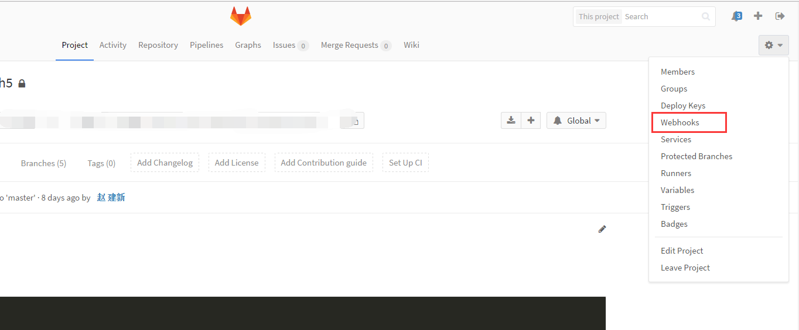
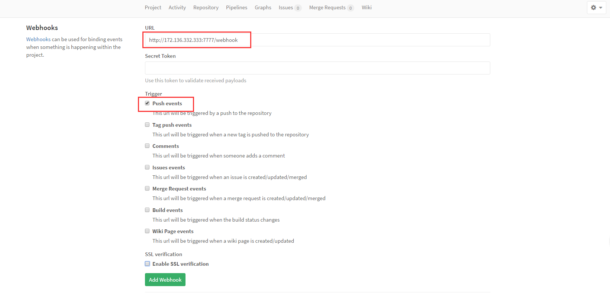
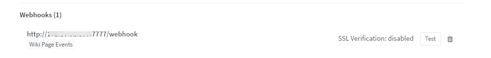

# gitlab自动化部署

## 本包为解决什么样的问题而存在？

gitlab的自动化部署，当你push或者merge到master分支的时候，就自动在测试或者生产的服务器上拉取最新的代码进行build。

## 原理

gitlab的webhook是当你在gitlab上触发一个事件的时候，gitlab就向某台指定的服务器发送一个http请求，服务器监听请求，执行预定义的脚本

## 环境要求

* 安装node
* 安装git

## 使用步骤

### 1. 点击gitlab的项目中的设置按钮下的webhooks，进入到设置页面


### 2.进入设置页面，填写代码要部署的机器的ip以及端口，后边跟上/webhook,如下图的示例。点击Add Webhook


### 3.gitlab上成功添加之后可以看到你的webhook列表


### 4.然后我们就要在指定的服务器哪里接受POST请求了，方法就是ssh登录到你那台服务器，克隆本项目。启动本项目就ok了，如何用ssh登录可自行谷歌。下面是本项目的文件介绍和具体配置的细节

#### 克隆本项目

```
git clone https://github.com/JesseZhao1990/gitlab-webhooks.git

```

#### 项目结构

有用的文件一共三个，config.js index.js webhooks.sh

config.js 是配置文件，配置监听端口和监听的location以及什么样的事件去执行那些shell文件。

index.js 是node执行文件。详细的执行细节在这里面

webhooks.sh 是收到push或者merge事件之后，要执行的shell脚本。你需要根据你项目的实际情况来修改这个文件（不修改无法正确运行！！！！！，因为你需要告诉shell脚本去哪个目录下拉什么代码怎么build，这个是因项目不同而不同。）

#### 详解webhooks.sh

指定web目录，你的前端文件在哪里，就把绝对路径拷过来给WEB_PATH
```
WEB_PATH='/root/caidanmao_h5'    
WEB_USER='root'
WEB_USERGROUP='root'

```
cd进入到项目目录下，切到master分支，拉代码

```
cd $WEB_PATH
git reset --hard origin/master
git clean -f
git pull
git checkout master

```
安装项目依赖，运行build命令

```
npm install
npm run build

```
### 5.项目配置完了，介绍也结束了。那现在启动项目


```
cd gitlab-webhooks/
npm install
npm run start

```


